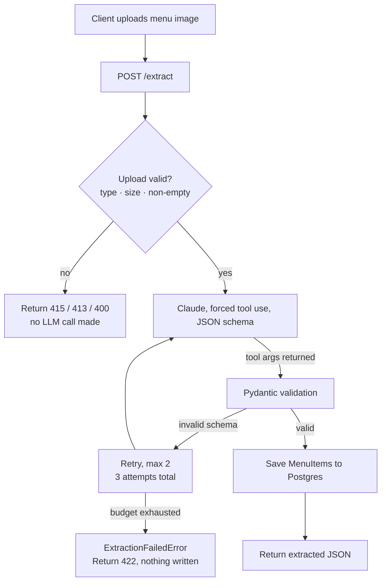
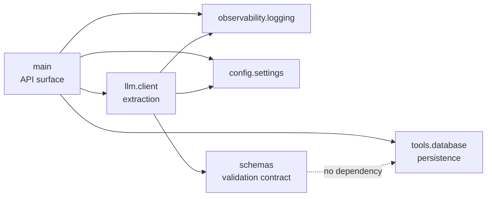

# Architecture — menuforge

A module map: for each module, what it exposes, what it hides behind that, what
it depends on, and how it is tested without the rest of the system.

Why it is built this way is in [DECISIONS.md](DECISIONS.md). What it does and
does not do is in [PRD.md](PRD.md).

---

## Request flow



**Changes from the prototype's diagram** (`restoai/README.md`):

| Change | Why |
|---|---|
| Added the **upload validation gate** before the model call | PRD FR-5. The prototype has no such check; rejecting early means a bad upload costs no API spend. |
| Retry now loops **back into the model call** | The original drew retry as a terminal branch. The retry re-calls the model — the loop is the point. |
| Validation is drawn **after** the model call, on the returned tool arguments | The original branched on "invalid schema" before Pydantic validation, implying two separate checks. There is one: Pydantic on the tool arguments. |
| `422` node states **"nothing written"** | Makes the transactional guarantee visible: a request persists a whole menu or nothing. |
| Dropped **"log raw response"** from the `422` node | Ambiguous next to a rule that image bytes are never logged. Errors are logged; payloads are not. |

---

## Module map

```
src/menuforge/
├── main.py                    API surface        ─┐
├── llm/client.py              extraction         ─┤
├── schemas/menu.py            validation contract─┤ four modules
├── tools/database.py          persistence        ─┘
├── config/settings.py         supporting
└── observability/logging.py   supporting
```

### Dependency direction



Dependencies point **one way, inward**. `schemas` is the innermost module and
imports nothing from the project. Nothing imports `main`.

**`config.settings` imports nothing from the project either**, so it can be read
from anywhere without creating a cycle. It is a leaf, like `schemas`.

**`tools.database` deliberately does not import `schemas`.** Persistence has no
business knowing the shape the LLM returns. `main` owns the mapping from
`MenuItemSchema` → `MenuItem` — a few lines of translation, in exchange for a
storage layer that survives a change to the extraction contract untouched.

---

## `menuforge.schemas` — validation contract

The single source of truth for what a valid extracted menu is. Used to validate
the model's output *and* to shape the API response, so the two cannot drift.

| | |
|---|---|
| **Public interface** | `MenuItemSchema` — `name: str`, `price: float`, `description: str = ""`, `modifiers: list[str] = []`<br>`ExtractedMenu` — `items: list[MenuItemSchema]` |
| **Hides** | Which fields are required vs. defaulted, coercion rules, and what counts as a validation failure. Callers see `ValidationError` or a valid object — never partial data. |
| **Depends on** | Pydantic only. **No project imports.** |
| **Tested in isolation** | Pure unit tests — construct from dicts, assert valid input passes and that a missing `price` or a non-numeric `price` raises `ValidationError`. No mocks, no I/O, no network. |

> This module is also the reason the tool's JSON schema in `llm.client` exists in
> two places — see the drift note under `llm.client` below.

---

## `menuforge.llm.client` — extraction

Owns everything about talking to Claude: the tool definition, forcing the tool
call, and the retry budget. This is the only module that knows an LLM is involved.

| | |
|---|---|
| **Public interface** | `extract_menu(image_bytes: bytes, media_type: str) -> ExtractedMenu`<br>`ExtractionFailedError` — raised when the retry budget is exhausted |
| **Hides** | The Anthropic SDK and client construction · the model id and `max_tokens` · base64 encoding of the image · the `extract_menu` tool schema and `tool_choice` · digging the `tool_use` block out of the response · **the entire retry loop** — callers cannot observe how many attempts happened |
| **Depends on** | `anthropic`, `pydantic`, `menuforge.schemas`, `menuforge.observability.logging`, `menuforge.config.settings` (model, retry budget, `max_tokens`, effort), and `ANTHROPIC_API_KEY` from the environment |
| **Tested in isolation** | The client factory is patched, so no network call and no API key are needed. A fake response object carries a `tool_use` block with a chosen payload; `side_effect` sequences bad-then-good responses to drive the retry path. Tests assert both the **result** and the **call count**, which is the only way the retry budget is observable. Because those fakes encode what we *assume* the API does, `tests/test_live.py` checks the assumption against the real service — one paid call, opt-in, see [D-005](DECISIONS.md#d-005--live-api-tests-are-opt-in-and-off-the-push-path). |

**Contract with callers:** returns a fully validated `ExtractedMenu`, or raises
`ExtractionFailedError`. Never returns partial or unvalidated data. A caller
never sees a `ValidationError` — that is an internal condition the retry loop
handles.

**Known drift risk:** the tool's JSON input schema is declared here, while the
Pydantic model lives in `schemas`. They describe the same shape and are kept in
sync by hand. Changing one without the other means the model is asked for a shape
that then fails validation on every attempt — the retry loop will mask this as
intermittent-looking `422`s rather than a clear error. **Change them together.**

---

## `menuforge.tools.database` — persistence

Owns the SQLAlchemy engine, session factory, and the one table.

| | |
|---|---|
| **Public interface** | `MenuItem` — SQLAlchemy model (`id`, `name`, `price`, `description`, `modifiers`)<br>`get_session()` → a `Session`<br>`init_db()` — creates tables |
| **Hides** | The connection string and how it is read from the environment · engine and `sessionmaker` construction · the declarative `Base` · that `modifiers` is stored as a JSON column |
| **Depends on** | `sqlalchemy` and `DATABASE_URL` from the environment. **No project imports** — notably not `schemas` (see above). |
| **Tested in isolation** | Point `DATABASE_URL` at a throwaway database, call `init_db()`, write and read a row. Isolated from the LLM entirely — no mock needed, because this module has never heard of it. |

**Session lifecycle is the caller's job.** `get_session()` hands back an open
session; the caller closes it in a `finally`. Deliberate: with one endpoint doing
one write, a dependency-injection layer would be indirection for its own sake.
Noted here because it is the kind of thing that stops being fine as endpoints
multiply.

---

## `menuforge.main` — API surface

The composition root. The only module that knows about both extraction and
persistence, and the only one that turns exceptions into HTTP status codes.

| | |
|---|---|
| **Public interface** | `app` — the FastAPI application<br>`POST /extract` — image → validated menu JSON<br>`GET /items` — all stored items<br>startup hook calling `init_db()` |
| **Hides** | Upload validation rules · the mapping from `MenuItemSchema` to `MenuItem` · the exception-to-status-code translation (`ExtractionFailedError` → `422`, bad type → `415`, oversized → `413`, empty → `400`) · session open/close |
| **Depends on** | `fastapi`, `menuforge.llm.client`, `menuforge.tools.database`, `menuforge.observability.logging`, `menuforge.config.settings` (upload limits, log level) |
| **Tested in isolation** | FastAPI's `TestClient` against a patched `extract_menu` and a throwaway database. Endpoint tests assert **status codes and response shape**, not extraction behaviour — that is `llm.client`'s test. Upload-validation tests additionally assert the extraction mock was **never called**. `tests/test_server.py` repeats the critical paths against a **real uvicorn server on a socket**, covering what `TestClient` substitutes for: HTTP/1.1 parsing, multipart framing, and the server's own error responses. |

**Holds no logic of its own** beyond validation, mapping, and error translation.
Anything more interesting than that belongs in one of the modules below it.

---

## `menuforge.observability.logging` — supporting

| | |
|---|---|
| **Public interface** | Logger configuration and a helper for emitting structured events (operation start, success with duration, error) |
| **Hides** | Log format and handler configuration, and the **redaction rules** — the guarantee that image bytes and the API key never reach a log sink |
| **Depends on** | Standard library `logging`, plus config |
| **Tested in isolation** | Capture emitted records and assert required fields are present, and that a record built from an image payload and a key-bearing environment contains neither (PRD SC-7). |

---

## `menuforge.config.settings` — supporting

| | |
|---|---|
| **Public interface** | `get_settings()` → cached `Settings` · `load_settings()` → uncached · `reset_settings()` · `DEFAULTS` · the `Settings` model (`app_name`, `environment`, `logging`, `llm`, `upload`) |
| **Hides** | Which file is read and where it lives · YAML parsing · the environment-variable override table · the three-layer precedence rule · the caching |
| **Depends on** | `pyyaml`, `pydantic`, and `MENUFORGE_*` environment variables. **No project imports.** |
| **Tested in isolation** | Write YAML into a temp directory, point `MENUFORGE_CONFIG_DIR` at it, and assert each layer of precedence. Separate tests load the **repo's own** `config/*.yaml`, so the shipped files cannot drift back into decoration. |

**Precedence, strongest first:** environment variable → `config/<environment>.yaml`
→ code default. The environment is chosen by `MENUFORGE_ENV` (default
`development`).

**Secrets are not settings.** `ANTHROPIC_API_KEY` and `DATABASE_URL` are read from
the environment at their point of use and have no field on `Settings`. Every
section sets `extra="forbid"`, so a credential written into a YAML file **fails
the load** rather than being quietly accepted.

Settings load **lazily**, never at import time: `main`'s lifespan hook loads
`.env` first and then drops the cache, so configuration always observes the
environment the process actually ended up with.

---

## What is not here

No agent loop, no orchestrator, no memory store, no prompt registry, no MCP
server, no evaluation harness. The reference scaffold provides all of them; this
is one endpoint making one LLM call, and stubs for absent concepts are worse than
their absence. See [PRD.md §5](PRD.md#5-out-of-scope).
